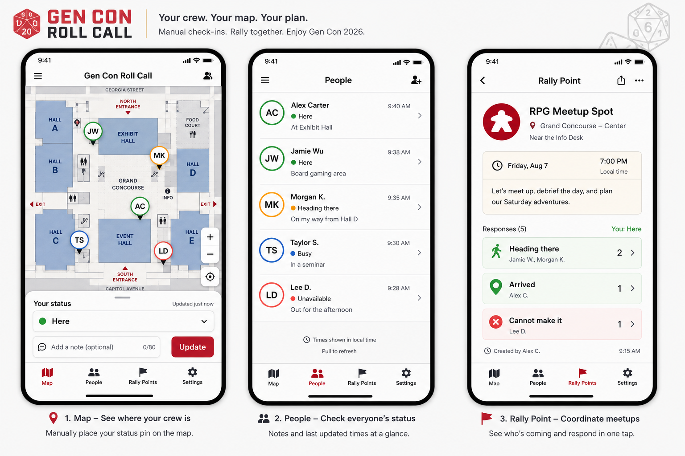

# Design System

## Concept Reference

Initial generated concept:



This is an early visual direction, not an accepted final implementation spec. Use it to keep the first build visually coherent, then update this document when the app UI is approved.

Do not treat generated mockup content as product truth. The mockup includes placeholder examples such as non-final status wording and sample rally dates; implementation must use the statuses and event dates in the product brief.

## Design Position

Mobile-first operational tool with restrained convention flavor.

The app should feel like a clear coordination surface at a busy tabletop convention: fast, legible, and friendly, without becoming a fantasy-themed dashboard or public social app.

## Visual Direction

- Main screen is the shared map, not a marketing page.
- Use a crisp light base with controlled warm accents.
- Use Gen Con-inspired red and gold as action/status accents, not as full-page decoration.
- Use map-blue for location and navigation affordances.
- Use ink-black text for high contrast.
- Use subtle dice/checkpoint motifs only when they clarify interactions.
- Avoid purple gradients, dark blue/slate dashboard styling, beige/brown-heavy themes, and nested card stacks.

## Color Tokens

These are starting tokens for implementation. Adjust only after browser screenshots and design review.

```text
--color-bg: #F8FAFC
--color-surface: #FFFFFF
--color-surface-warm: #FFF8E7
--color-text: #151821
--color-muted: #667085
--color-border: #D8DEE8
--color-map-blue: #2F80ED
--color-gencon-red: #D6382F
--color-gold: #F4B740
--color-green: #1E9F6E
--color-orange: #F97316
--color-shadow: rgba(15, 23, 42, 0.14)
```

## Typography

Use a modern sans-serif stack until a brand font is chosen:

```css
font-family: Inter, ui-sans-serif, system-ui, -apple-system, BlinkMacSystemFont, "Segoe UI", sans-serif;
```

Starting scale:

- Screen title: 24px, 700, line-height 1.15
- Section title: 18px, 700, line-height 1.25
- Body: 15px, 500, line-height 1.45
- UI label: 12px, 700, line-height 1.2
- Caption: 12px, 500, line-height 1.35
- Button: 15px, 700, line-height 1

Do not rely on browser-default control typography.

## Component Rules

### App Shell

- Phone-first layout.
- Bottom navigation with four tabs: Map, People, Rally Points, Settings.
- Minimum touch target: 44px.
- Keep the active tab obvious with icon, text, and accent color.

### Map Surface

- Map fills the primary viewport area.
- Pins sit above the map layer and scale visually independent of zoom where practical.
- Each member pin shows initials and a small status ring/dot.
- Rally points use a distinct marker shape from people pins.
- Show "last updated" in people details or selected marker sheet.

### Sheets and Panels

- Use bottom sheets for mobile actions.
- Radius: 8px for cards/sheets unless a platform component requires otherwise.
- Avoid nested cards.
- Use a single sheet at a time for member status, rally creation, or marker details.

### Status Indicators

- Status must be visible through both text and color.
- Never rely on color alone.
- Use consistent status labels from the product brief.

### Forms

- Keep forms short.
- Password gate: one password field and one primary action.
- Onboarding: one display-name field and one primary action.
- Rally creation: title, optional note, optional time.

## Motion

- Use short 120-180ms transitions for sheets, selected states, and marker focus.
- Respect `prefers-reduced-motion`.
- Do not animate location changes in a way that implies continuous tracking.

## Accessibility

- Preserve high contrast on map overlays.
- Buttons and marker controls need accessible labels.
- All flows must be usable without GPS permissions.
- Status and freshness should be screen-reader-readable text, not only visual dots.
