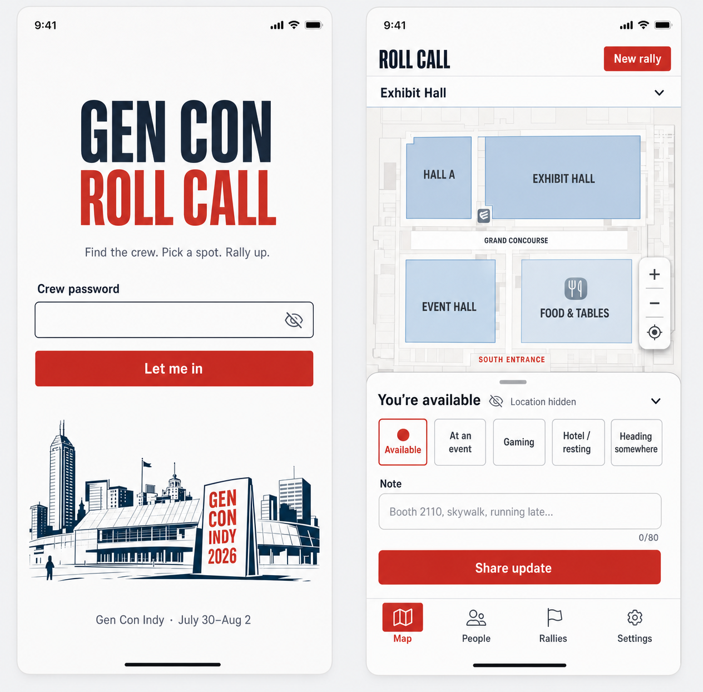
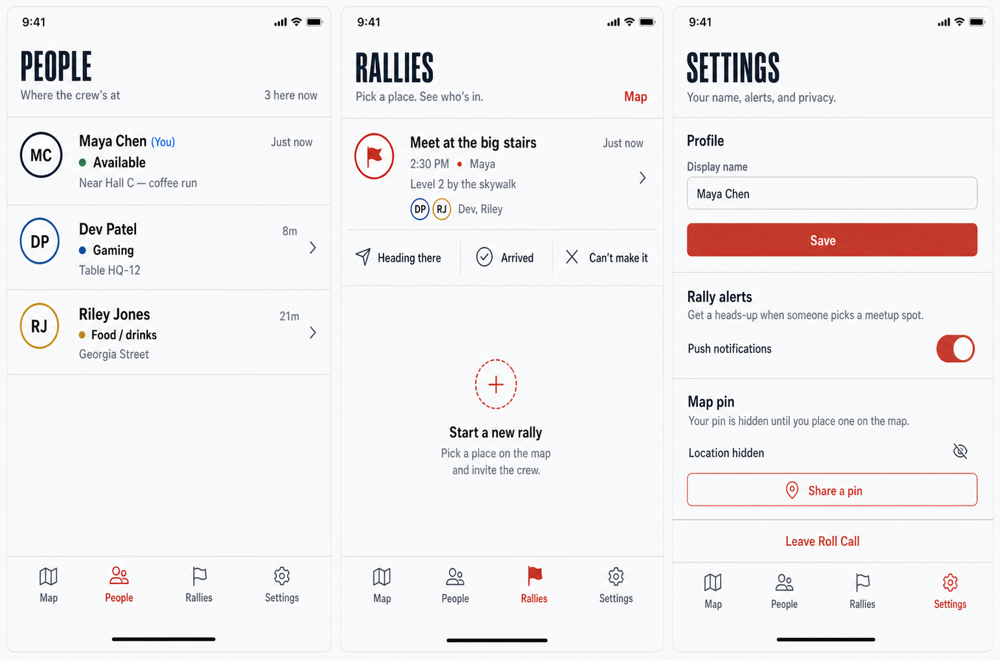

# Design System

## Concept Reference

Current UX-023 concepts:





These concepts define the active visual direction. Product behavior and the canonical status/rally
vocabulary still come from the product brief; sample names, notes, and times are illustrative.

## Design Position

Mobile-first convention field guide for one friend group.

The app should feel like a clear coordination surface at a busy tabletop convention: fast, legible, and friendly, without becoming a fantasy-themed dashboard or public social app.

## Visual Direction

- Main screen is the shared map, not a marketing page.
- Use editorial condensed mastheads, crisp white surfaces, and open rows divided by fine rules.
- Use convention red and gold as action/status accents, not as full-page decoration.
- Use map-blue for location and navigation affordances.
- Use ink-black text for high contrast.
- Use subtle dice/checkpoint motifs only when they clarify interactions.
- Avoid purple gradients, dark blue/slate dashboard styling, beige/brown-heavy themes, generic
  rounded-card stacks, and implementation-facing copy.

## Color Tokens

These are starting tokens for implementation. Adjust only after browser screenshots and design review.

```text
--color-bg: #F4F6F8
--color-surface: #FFFFFF
--color-surface-warm: #FFF8E7
--color-text: #102033
--color-muted: #596777
--color-border: #D9DEE4
--color-map-blue: #1769AA
--color-gencon-red: #D52B1E
--color-gold: #C98A00
--color-green: #14865C
--color-orange: #D26714
--color-shadow: rgba(16, 32, 51, 0.13)
```

## Typography

Use the system sans stack for body and UI text. Display mastheads use a condensed system stack so
the app keeps its editorial voice without requiring a font download:

```css
font-family: Inter, ui-sans-serif, system-ui, -apple-system, BlinkMacSystemFont, "Segoe UI", sans-serif;
--font-display: "Arial Narrow", "Roboto Condensed", "Helvetica Neue", sans-serif;
```

Starting scale:

- Screen title: 24px, 700, line-height 1.15
- Section title: 18px, 700, line-height 1.25
- Body: 15px, 500, line-height 1.45
- UI label: 12px, 700, line-height 1.2
- Caption: 12px, 500, line-height 1.35
- Button: 15px, 700, line-height 1

Do not rely on browser-default control typography.

## Component Rules

### App Shell

- Phone-first layout.
- Bottom navigation with four tabs: Map, People, Rally Points, Settings.
- Minimum touch target: 44px.
- Keep the active tab obvious with icon, text, and accent color.

### Map Surface

- Map fills the primary viewport area.
- Pins sit above the map layer and scale visually independent of zoom where practical.
- Each member pin shows initials and a small status ring/dot.
- Rally points use a distinct marker shape from people pins.
- Show "last updated" in people details or selected marker sheet.

### Sheets and Panels

- Use bottom sheets for mobile actions.
- Radius: 6–10px for controls and 18px only for the mobile map sheet.
- Prefer open sections and divided rows; avoid nested cards.
- Use a single sheet at a time for member status, rally creation, or marker details.

### Status Indicators

- Status must be visible through both text and color.
- Never rely on color alone.
- Use consistent status labels from the product brief.

### Forms

- Keep forms short.
- Password gate: one password field and one primary action.
- Onboarding: one display-name field and one primary action.
- Rally creation: title, optional note, optional time.

## Motion

- Use short 120-180ms transitions for sheets, selected states, and marker focus.
- Respect `prefers-reduced-motion`.
- Do not animate location changes in a way that implies continuous tracking.

## Accessibility

- Preserve high contrast on map overlays.
- Buttons and marker controls need accessible labels.
- All flows must be usable without GPS permissions.
- Status and freshness should be screen-reader-readable text, not only visual dots.
